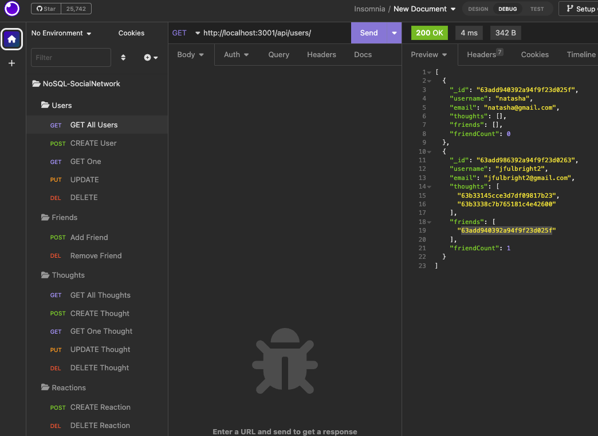
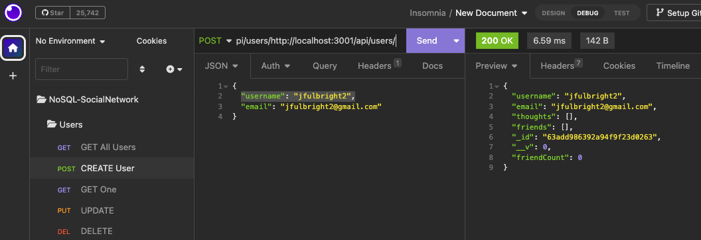
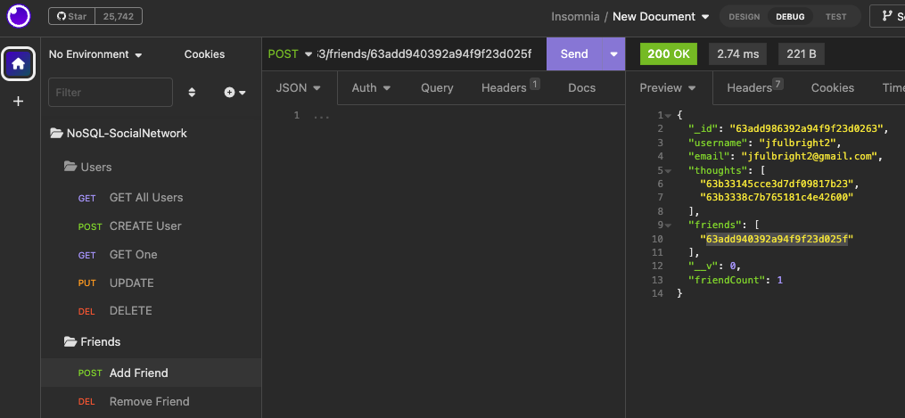

# Social Media API and MongoDB Backend
  

## Description:
This is an API for a social network web application where users can share their thoughts, react to friends' thoughts, and create a friend list. It uses Express.js for routing, a MongoDB database, the Mongoose ODM, and native JavaScript Date object to format timestamps. The seed data is created using Insomnia.

## Video Demonstration:
[Video Demo](https://drive.google.com/file/d/1jBs5IOS4HBlog0ipH-uA3leHbF6omVLx/view)

## Table of Contents:
- [Social Media API and MongoDB Backend](#social-media-api-and-mongodb-backend)
  - [Description:](#description)
  - [Video Demonstration:](#video-demonstration)
  - [Table of Contents:](#table-of-contents)
  - [Installation](#installation)
  - [Usage](#usage)
    - [Return Users:](#return-users)
    - [Create User:](#create-user)
    - [Add Friend:](#add-friend)
  - [Technology](#technology)
  - [Questions](#questions)
  - [Contributing](#contributing)
  - [Tests](#tests)
  - [License](#license)

## Installation
_________________
1. Clone repository on GitHub.

2. Visual Studio Code:
  1. Open the cloned file.
  2. Create your `.gitignore` file.
  3. Check the dependencies and dev dependencies needed on package.json.
  4. To set up all the existing npm packages, run `npm init`.

3. To install the dependencies on the `node_modules` folder, run 'npm install' or

  1. `npm i express` to install Express.js;
  2. `npm i mongoose` to install Mongoose; and
  3. `npm i nodemon` to install Nodemon.
  4. Ensure that MongoDB is installed on your machine.
4. To invoke the application, run `npm start`.
5. When the server is started, the Mongoose models are synched to the MongoDB database.

## Usage
_________________

A user can utilize this API to create a new user with a valid username and email, add other users as friends, post "thoughts" as well as "reactions" to thoughts, update and delete thoughts and reactions, and delete friends.

  ### Return Users:
  

  ### Create User:
  

  ### Add Friend:
  

## Technology
_________________
* JavaScript
* Node.js
* Express.js
* MongoDB
* Mongoose
* Insomnia

## Questions
  _________________
  Contact me with any questions, comments or suggestions at:
* [GitHub.com/jfulbright](http://github.com/jfulbright)
* [jfulbright](mailto:jfulbright)
* [LinkedIn.com/in/JeremyFulbright](https://www.linkedin.com/in/JeremyFulbright)

## Contributing
_________________
To contribute to this application: Please email the author for guidelines.

## Tests
_________________
Insomnia is used to test REST API calls. Please see the walk-through demonstration videos as well as the sections on Description and Usage to see how data is added and tested using Insomnia.

## License
_________________

* This project is licensed under the terms of the MIT license.
* [https://lbesson.mit-license.org/](https://lbesson.mit-license.org/)
* Legal Code: [LICENSE](LICENSE)

